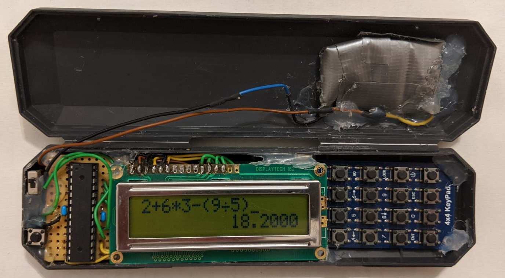

# avr-calculator



### Input mode:
Key map:
```
+---+---+---+---+
| 1 | 2 | 3 |CLR|
+---+---+---+---+
| 4 | 5 | 6 |DEL|
+---+---+---+---+
| 7 | 8 | 9 | . |
+---+---+---+---+
| ( | 0 | ) | = |
+---+---+---+---+
```

Key map (with shift):
```
+----+----+----+---+
|sin |cos |tan | + |
+----+----+----+---+
| <- | PI | -> | - |
+----+----+----+---+
| X  |pow |log | * |
+----+----+----+---+
|asin|acos|atan| / |
+----+----+----+---+
```
Note: No sqrt, because sqrt(x) = x^(1/2)

### Table Start/Step mode:
Key map:
```
+---+---+---+---+
| 1 | 2 | 3 |CLR|
+---+---+---+---+
| 4 | 5 | 6 |DEL|
+---+---+---+---+
| 7 | 8 | 9 | . |
+---+---+---+---+
|   | 0 |   | = |
+---+---+---+---+
```

Key map (with shift):
```
+---+---+---+---+
|ESC| ^ |   |   |
+---+---+---+---+
| < |   | > |(-)|
+---+---+---+---+
|   | v     |   |
+---+---+---+---+
|   |   |   |   |
+---+---+---+---+
```

### Table mode:
Key map:
```
+---+---+---+---+
|ESC|-1 |   |   |
+---+---+---+---+
|-10|   |+10|   |
+---+---+---+---+
|   |+1 |   |   |
+---+---+---+---+
|   |   |   |   |
+---+---+---+---+
```
